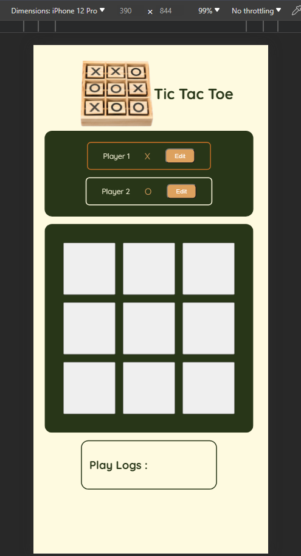
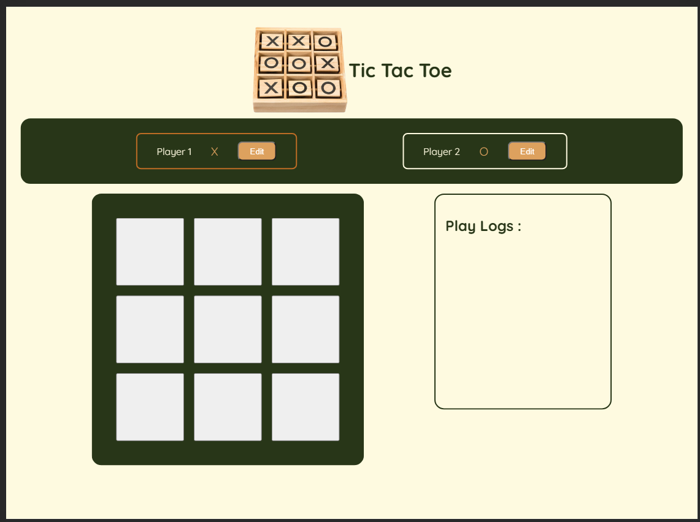

# React Tic Tac Toe App

Welcome to the React Tic Tac Toe App! This is a simple and interactive Tic Tac Toe game built using React. It's designed to be user-friendly and responsive, providing an enjoyable gaming experience.

## Table of Contents

- [Features](#features)
- [Installation](#installation)
- [Usage](#usage)
- [Demo](#demo)
- [Contributing](#contributing)

## Features

- **User-Interactive**: Enjoy a responsive and engaging gaming experience.
- **Responsive Design**: The app is designed to work seamlessly on various screen sizes, from desktops to mobile devices.
- **Game State Management**: The app efficiently manages the game state, ensuring a smooth and enjoyable gameplay flow.
- **Clear UI**: The user interface is clean and straightforward, making it easy for players to focus on the game.

## Installation

To run the Tic Tac Toe app locally, follow these steps:

1. Clone the repository:

```bash
git clone https://github.com/Anant-Singh-Chauhan/tic_tac_toe.git
```

2. Install dependencies:

```bash
npm install
```

## Usage

After completing the installation, start the development server:

```bash
npm start
```

Open your browser and navigate to http://localhost:3000 to play the Tic Tac Toe game. Have fun!

## Demo
Screenshots:

Mobile View


Web View



For a live demo, visit https://anant-singh-chauhan.github.io/tic_tac_toe/.

## Contributing

Contributions are welcome! If you find any issues or have suggestions for improvement, please create an issue or submit a pull request. Make sure to follow the existing coding style and conventions.

Happy gaming! 🎮

## Thanks for visiting!