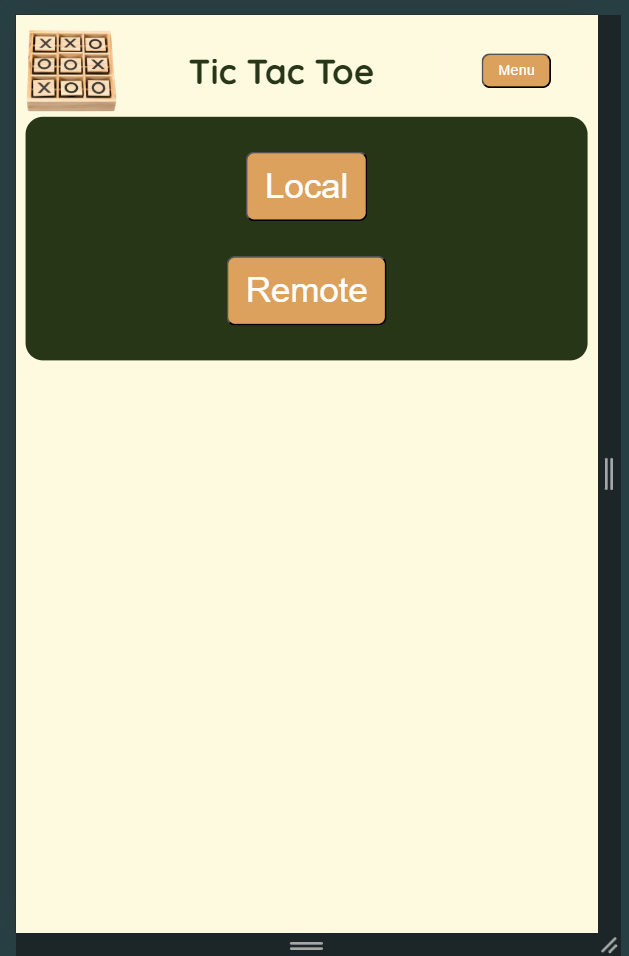
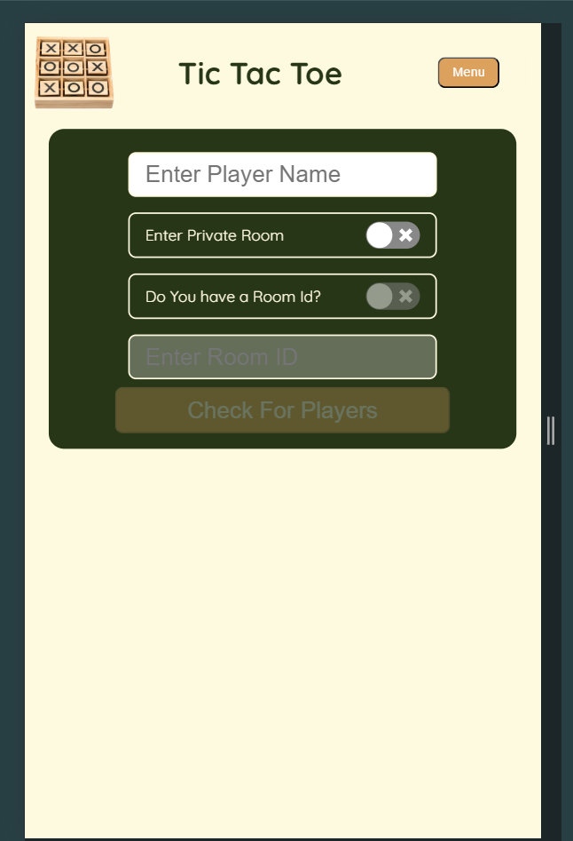
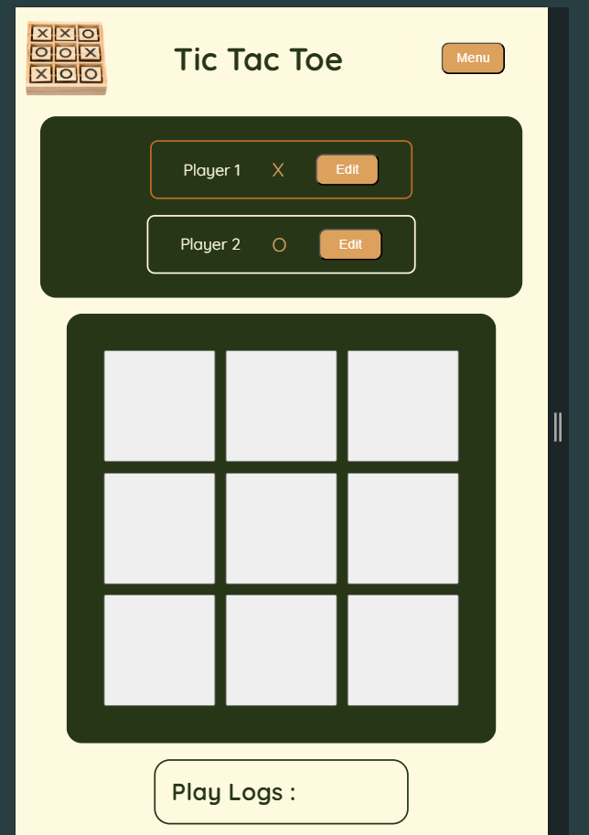
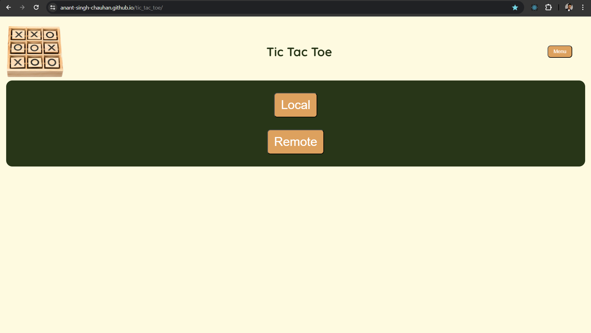

## Tic Tac Toe | Local and Remote Plays

Welcome to Tic Tac Toe! This is a simple and interactive app game built using React. It's designed to be user-friendly and responsive, providing an enjoyable gaming experience. It enables user to play games **Locally** or **Remotely** wit randoms or friends as desired. The game also allows **Private Room** Plays.

- **Tech Stack**: For remote plays, a different repository is maintained

## Table of Contents

- [Features](#features)
- [Installation](#installation)
- [Usage](#usage)
- [Demo](#demo)
- [Tech Stack](#tech-stack)
- [Contributing](#contributing)

## Features

- **User-Interactive**: Enjoy a responsive and engaging gaming experience.
- **Responsive Design**: The app is designed to work seamlessly on various screen sizes, from desktops to mobile devices.
- **Game State Management**: The app efficiently manages the game state, ensuring a smooth and enjoyable gameplay flow.
- **Clear UI**: The user interface is clean and straightforward, making it easy for players to focus on the game.
- **Game Modes**:
    - **Local** : Allows 2-players to play on a single device
    - **Remote** : Allows 2-players to play remotely on 2 different devices. 
        *Remote* mode also has 2 sub modes: [ RANDOM and PRIVATE ROOM ]
        - **Random** : Allows users to play with random players online.
        - **Private Room** : Allows 2 players to connect  to a private room and enjoy friendly 1v1.
- **Chat feautre**: For people who play more in chats (IYKYK)


## Installation

To run the Tic Tac Toe app locally, follow these steps:

1. Clone the repository:

```bash
git clone https://github.com/Anant-Singh-Chauhan/tic_tac_toe.git
```

2. Install dependencies:

```bash
npm install
```

## Usage

After completing the installation, start the development server:

```bash
npm start
```

Open your browser and navigate to http://localhost:3000 to play the Tic Tac Toe game. Have fun!

## Demo
Screenshots:

Mobile View
- **Main Menu**


- **Remote Menu**


- **Game**


- **Chat Window**


Web View




For a live demo, visit https://anant-singh-chauhan.github.io/tic_tac_toe/.

## Tech Stack
The Frontend part of the app is built using React, Context Api, Socket.io.
Whereas, for backend dependency a separate repo is maintainted, made using Node.js, Express.js and Socket.io.

## Upcoming Features
- **Enable Chat Feature**
- **Maintain Score History**
- **Create and Store Friends List**
- **Favorites**
- **Notification to Friends for Play**

## Contributing

Contributions are welcome! If you find any issues or have suggestions for improvement, please create an issue or submit a pull request. Make sure to follow the existing coding style and conventions.

Happy gaming! 🎮

## Thanks for visiting!
